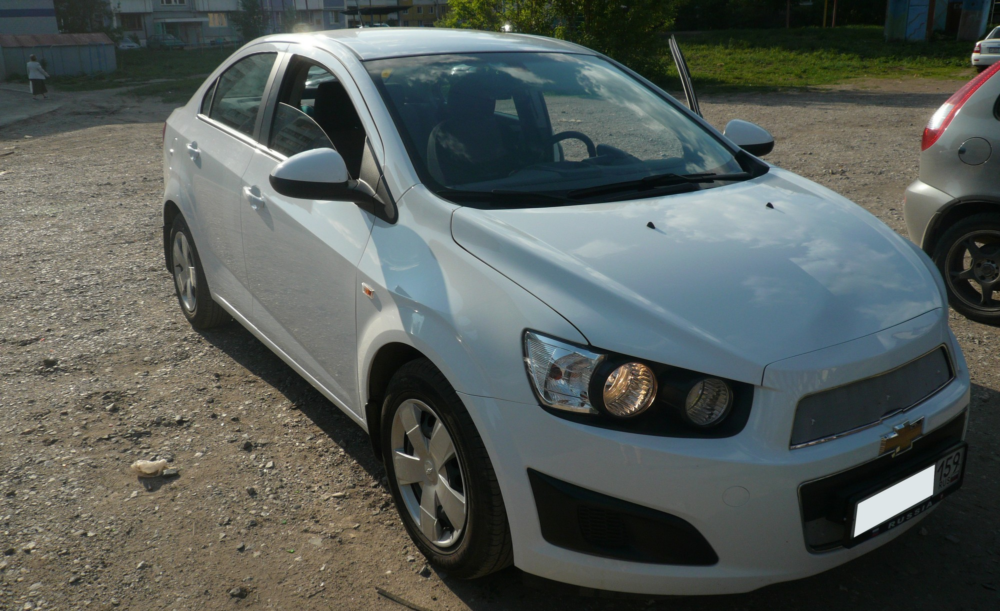
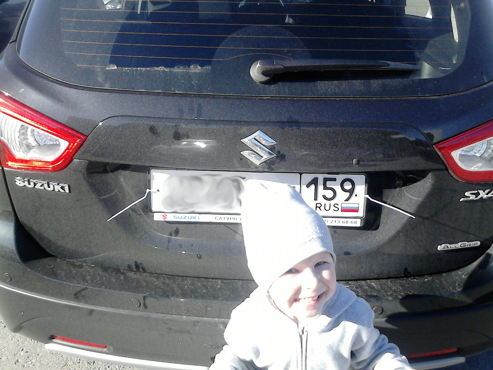
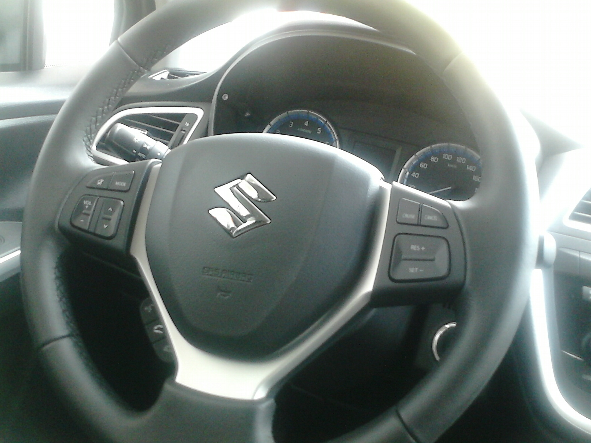

Махнули не глядя свою Chevrolet Aveo 2012г. на Suzuki SX4 New.
<!-- Read more -->

Прошлая Aveo:

Выбор был тяжелым.
И как и у многих, на Suzuki совсем не смотрели по началу. Зато когда узнали про эту марку и почитали обзоры, то выбор стал очевидным. По сравнению с остальными марками авто, в такой же ценовой категории, Suzuki смотрите выйгрышнее.

Сперва смотрели на Opel Mokka, но после того, как мастер из автосалона рассказал, что и как у нее начинает отпадывать, включая заклинивающую крышку у бензобака, то всё желание рассматривать дальше эту машину, отпало.

Вообще машину сравнивают, в большинстве своём, с Skoda Yeti, Nissan Qashqai, Opel Mokka, Mitsubishi ASX, Peugeot 3008, я бы добавил ещё Subaru XV и KIA Soul.

**Не буду многословен, просто прокомментирую две статьи.**

Первая - [http://info.drom.ru/surveys/26610/](http://info.drom.ru/surveys/26610/)

> Как результат — в потоке машин на новый SX4 ровным счетом никто не обращает внимания. Разве что яркий желто-зеленый цвет (как сказала моя половинка — цвет детской неожиданности) заставит задержать на машине взгляд чуть дольше обычного.

Про цвет детской неожиданности не соглашусь) Хотя тут конечно на вкус и цвет товарища нет, но смотрится вполне нормально) В живую по крайней мере. Правда не знаю, что будет с этим цветом после нескольких лет, не поменяет ли он своих оттенков от нашего солнца и погодных условий в целом.

> Да нет, не забыл. Но SX4 в работающем по умолчанию режиме «Auto» полноприводной трансмиссии AllGrip 4WD, что называется, не едет. И если в пределах разрешенных в городе 60 км/ч это не сильно мешает, то на трассе машина может вообще отказаться идти на обгон уже после 80 км/ч! На светофоре пробую стартовать с педалью «в пол» и… пока SX4 трогался с места, меня на полтора корпуса обставил едущий по соседнему ряду Logan!

Увы, но да. Если вы любите стартовать на светофоре с пробуксовкой, то вам лучше посмотреть в сторону BMW M5, хотя тут конечно совсем другая ценовая политика.

> Перевод трансмиссии в режим «Sport» избавляет машину от ощущения затянутого «ручника» и даже — наконец-то! — позволяет ехать более-менее активно.

Таки да, если хотите обогнать тот же Logan :-), то переводите в Sport, тогда проблем не будет. И по трассе вполне нормально обгонять, если конечно у вас в заднице нет шила.

> проверяя разгонную динамику нового SX4 с помощью измерительного комплекса Racelogic, нам удалось значительно превзойти заявленные японцами параметры: в режиме «Auto» кроссовер показал результат в 12,1 секунды, а в «спорте» 11,4 — по сути, на две секунды быстрее паспортных данных (хотя обычно бывает наоборот).

В общем машина вполне нормально едет, это не спорткар конечно. Для спокойных водителей вполне всё хорошо.

> А еще New SX4 лучше своих соперников по комфорту. Не сильно, но все же лучше. Главным образом — за счет плавности хода. При желании перед стандартными (пластиковыми) лежачими полицейскими можно вообще не притормаживать: подвеска и с низкопрофильными 17-дюймовыми шинами не допускает жестких ударов.

Тут я не знаю. Не ездил на других кроссоверах. Но вроде как да. Не сказал бы, что сильные удары бывают. Подвеска жесткая конечно, но именно удара не бывало, вроде. На прошлой нашей Aveo, на большой кочке, проходил именно удар, всегда боялись, не пробили ли стойки. Но зато у Aveo, потому как седан, более мягче подвеска, скорее всего у седанов всегда так. SX4 всё же больше "козлик".

> с дорог, пусть даже и грунтовых, на новом SX4 лучше не съезжать: геометрические параметры кузова здесь слабое звено. Да, подкапотное пространство снизу закрыто стальным листом защиты. Но этого мало. А откровенно низкая «губа» переднего бампера даже банальную парковку перед бордюром вынуждает делать аккуратно — не говоря уже о возможности заезда на него (или съезда — задний свес ненамного больше переднего).

Вы посмотрите на "губы" других)) Тот же Subaru XV, там вообще страшно за передний бампер, хотя на картинке всё красиво даже. В целом этим многие страдают. Клиренс тут тоже не из самых плохих. В том же Кашкае, вроде бы, куда меньше.

> «Наш» автомобиль был в максимальной комплектации GLX+. Однако даже здесь отсутствуют потолочная ручка водителя, охлаждение перчаточного ящика, держатели для карточек или авторучек в нем же, карман в спинке водительского кресла и хоть какие-нибудь пепельницы. А медиасистема вообще выглядит установленным «на стороне» дополнительным оборудованием.

Потолочная ручка для водителя? о_О зачем, простите? Охлаждение перчаточного ящика? Зачем, купите себе переносной холодильник? Держатели для карточек и ручек? Раскраску и фломастеры тоже некуда всунуть.
Карманы в спинке кресел, тут да, печально, но можно купить чехлы или "майки".
Пепельница? Бросайте это гиблое дело, по крайней мере в машине.
Медиасистема, наверно да, у нас ее нет. Но все на неё ругаются.

> Зеркала имеют функцию складывания, но полностью к бокам кузова не прижимаются, выступая на несколько сантиметров.

Сперва тоже огорчился, но я и так забываю их вообще складывать.

> На заднем диване не хватает пространства над головой и мало вещевых отсеков.

Очень интересно, как у других. Пространство над головой... ну меньше надо было растишку есть. Вещевых отсеков? Что это? :-)

> А еще New SX4 холодный. Нет, печка у него работает нормально — когда двигатель прогреется. Вот только греется мотор долго. Во время теста в Москве температура держалась около нуля. Но даже в таких тепличных условиях стрелка указателя температуры двигателя входила в рабочую зону не ранее чем через 7-8 минут движения. А на холостых оборотах мотор вообще полностью не прогревается. Да и электрообогревы наружных зеркал и передних кресел слабоваты. Так что если в Suzuki не хотят провалить продажи модели в России, без дополнительных мер по «утеплению» не обойтись: по крайней мере, сибирякам я бы такой автомобиль сейчас не посоветовал.

Ждём зимы, но 7-8 минут вполне нормально. Неспешно выехать с автостоянки или со двора, примерно так и занимает. У нас по крайней мере. + минут 5-10 машина работает, пока отгребаешь её от снега, хотя многие не отгребают.

> Обзорность в целом неплохая, за исключением широкой левой стойки крыши и узкого просвета между подголовниками при взгляде назад.

Стойка это да, приходится крутить головой, высматривай пешеходов.

---

Ну и вторая статья - [http://autochel.ru/text/testdrive/759717.html](http://autochel.ru/text/testdrive/759717.html)
Она скорее информационная.

> Пожалуй, главная его проблема – безальтернативный мотор 1,6 (117 л.с.), модернизированная версия прежнего двигателя. Сам по себе SX4 не тяжелый – спасибо активному использованию высокопрочных сталей. Поэтому для базовых версий динамика достаточная: не хуже, чем у того же Yeti 1.2 TSI, Qashqai 1.6 или Mitsubishi ASX 1.6. Проблема в том, что почти все конкуренты предлагают более мощные моторы, которые востребованы у клиентов, планирующих регулярные вылазки на трассы. А SX4 с его двигателем словно намекает на городской ареал обитания, где динамики достаточно для размеренной езды.

Таки да, и об этом выше говорили.

Многие ругают машину за дороговизну, но видимо народ не понимает о чем говорит, или же рассматривает только 2WD, не понятно зачем.
В этой же статье, в самом низу, есть хорошая таблица, со всеми ценами и основными характеристиками. SX4 4WD смотрится куда выйгрышнее.

Ну и учитывайте ещё цену на обслуживание авто. Мокка или тот же Кашкай, ну или Субару, не факт, что там аксессуары и запчасти будут дешевле, у Субару уж точно. Да и Suzuki судя по обсуждениям ценятся своей надежностью.

Ещё, очень важный сегодня фактор, - не переведена ли сборка в Россию. К сожалению, всё, что начинают собирать у нас, в России, сразу падает качеством, та же Mazda и даже Camry стали уже не те.

По расходу у нас, кстати, держится пока 6.1 л./100км. По трассе опускается до 5.9-6.0 л./100км, скорость при этом не выше 120 км./ч.
На данный момент прошли ТО-0 (бесплатное), сменили масло и в двигателе (платно, по желанию).

Начал дребезжать левый рычажок переключения поворотников и света, но только на неровностях и то не всегда. По городу не дребезжит, а вот по трассе начинает.

Ну и вроде ничего такого больше нет, машина всем нравится и ездить на ней комфортно.

<iframe src="//instagram.com/p/pyhDgIxIPJ/embed/" width="612" height="710" frameborder="0" scrolling="no" allowtransparency="true"></iframe>

PS: советую почитать [форум](http://suzuki-club.ru/threads/66581/).

[Дельный и правильный обзор, наверно есть и другие в этой теме](http://suzuki-club.ru/threads/66581/page-38#post-1140457)

Перечислены большинство недостатков.
Вывод: берите ВАЗ :-)

С тормозами немного не согласен, не замечал такого, особенно проваливания. Даже наоборот, педаль становилась более "упругой, твердой" что ли.

**Последний вывод :-)**
> Если человек хочет кроме "чтобы ехала" еще приличную отделку салона, продуманность с точки зрения потребителя а не конвейера, дизайна это нужно идти куда угодно но только не в Сузуки.
