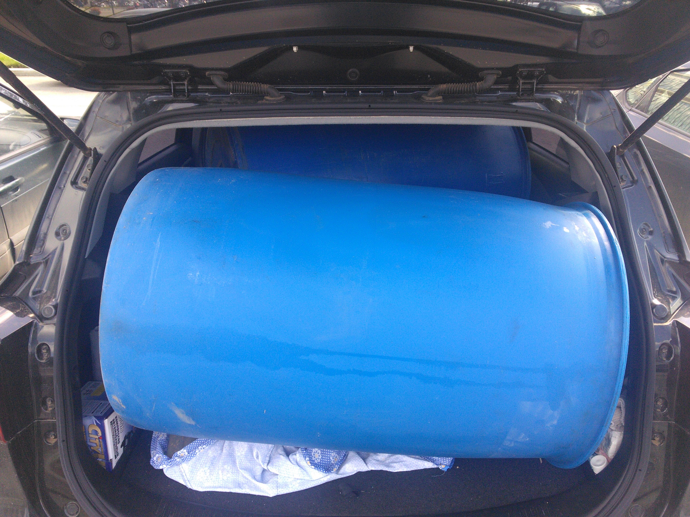
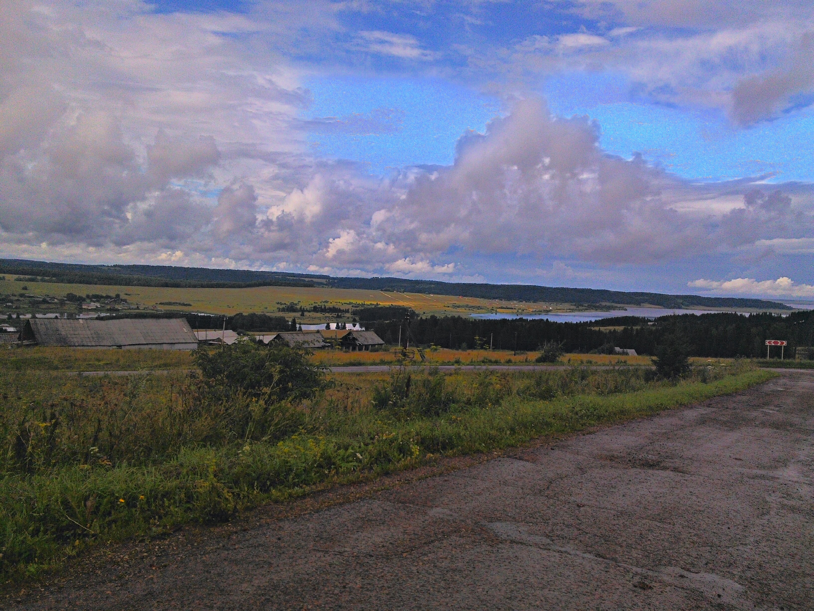
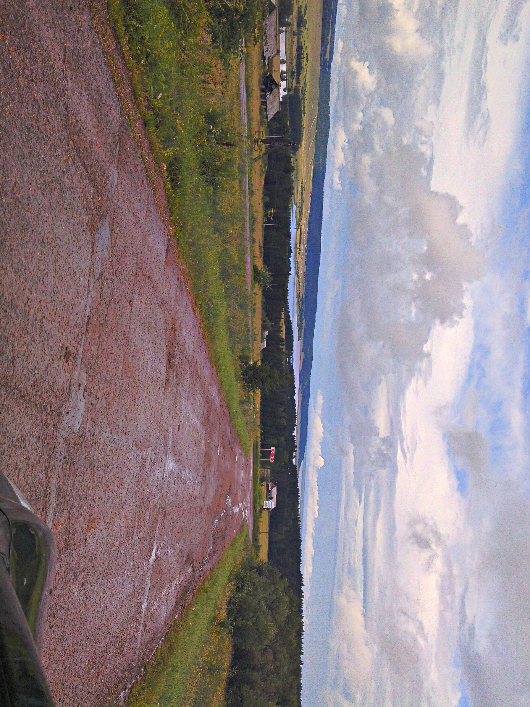
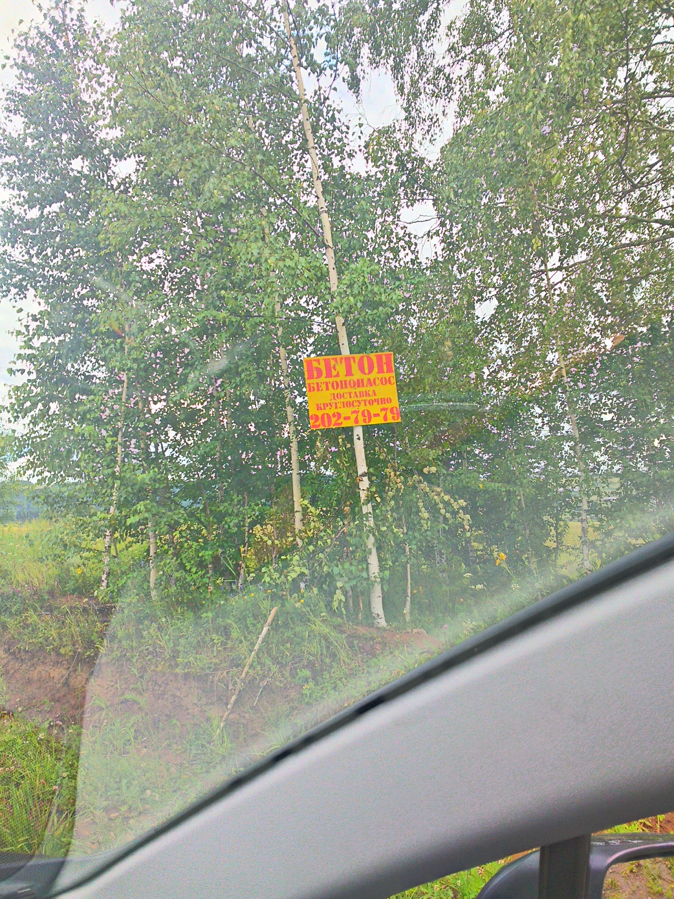
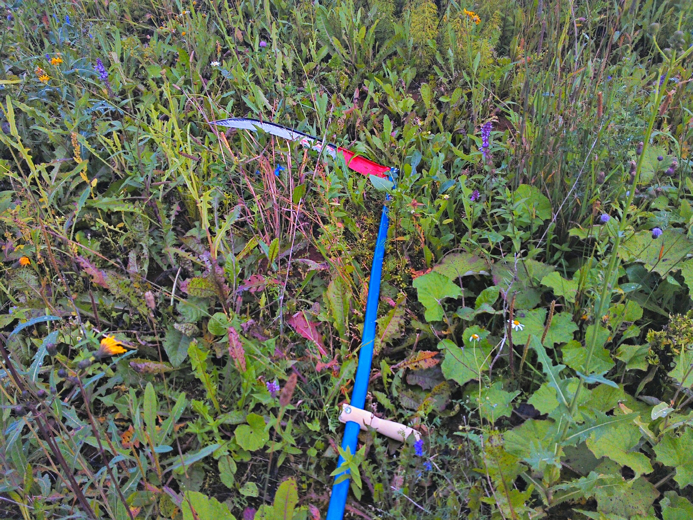
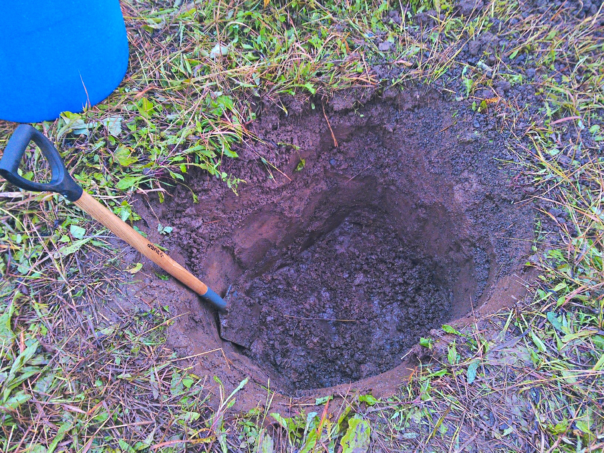
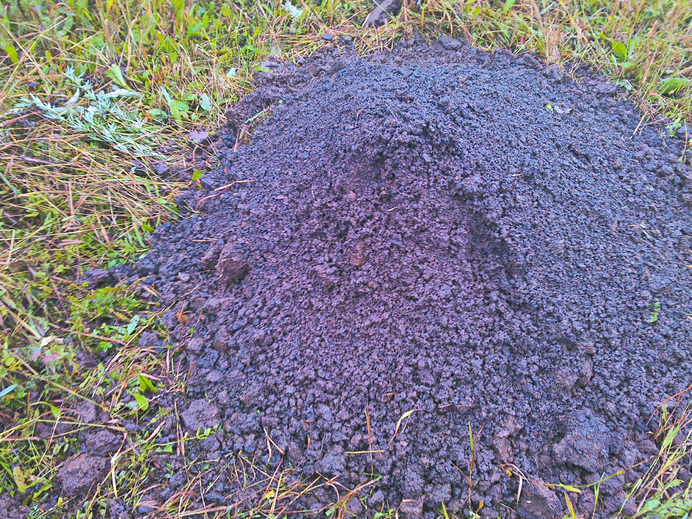
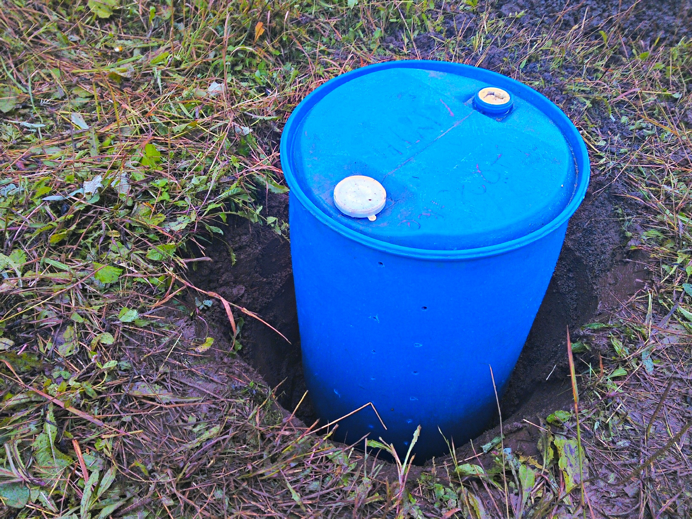
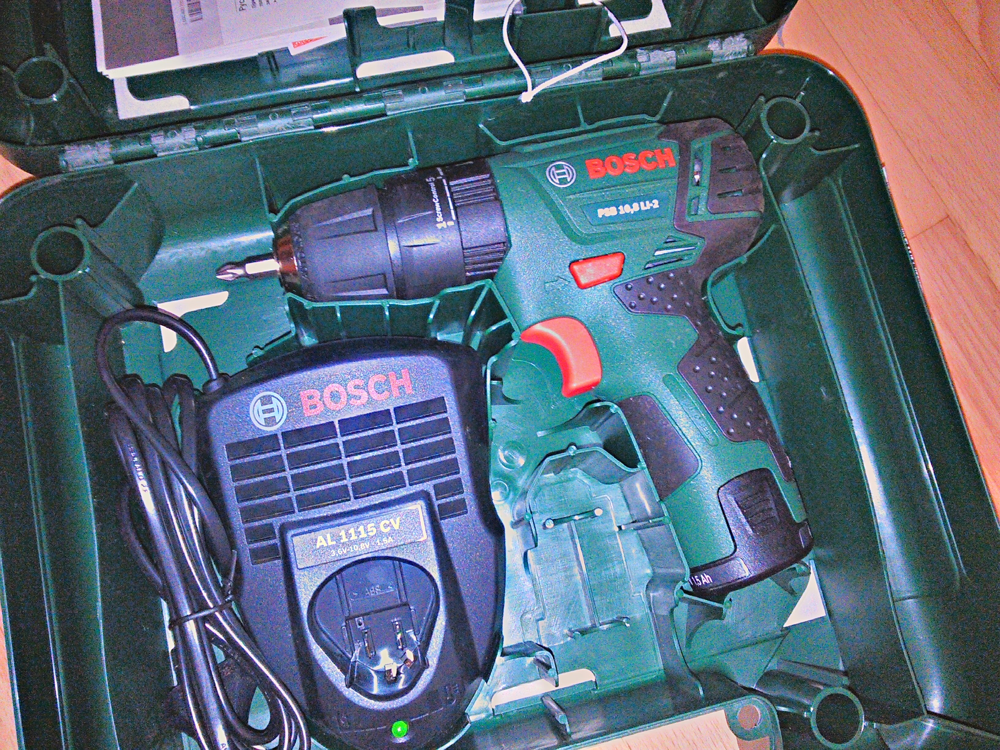
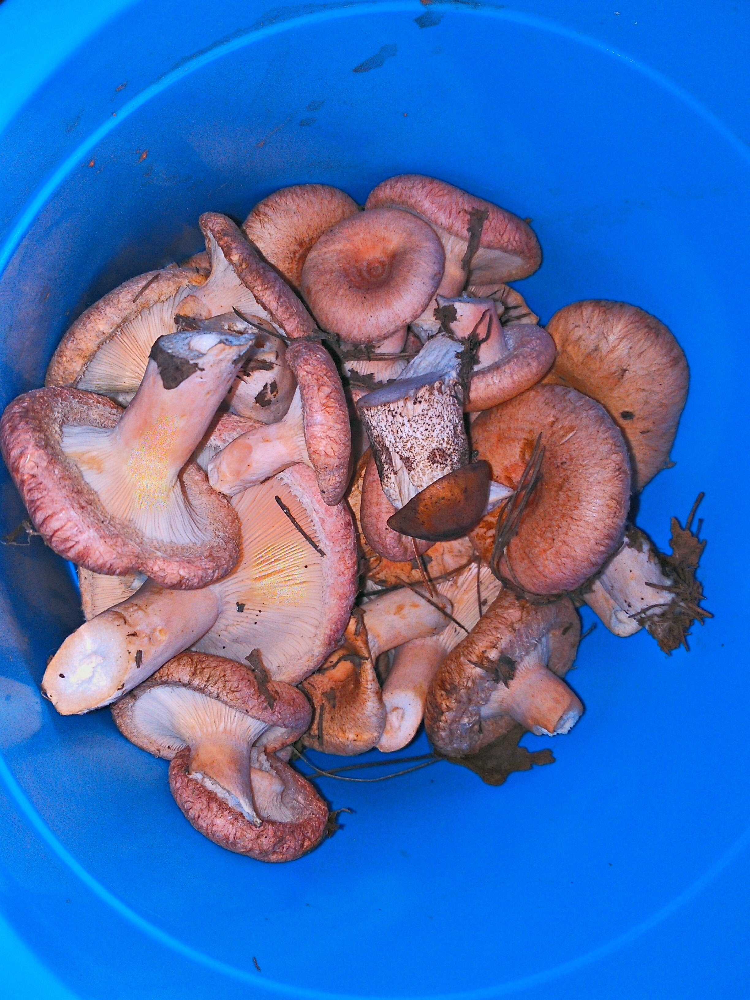

Дабы не гадить где попало, надо ставить туалет.

А под туалет надо яму. А чтобы яма на обвалилась, надо бочку. Ну раз надо, значит берём и везём бочку)

---

  

  

Ну и конечно же, надо бороться с травой, поэтому приобрели чудо-косу)

    

Пол метра плодородного слоя, а дальше глина глиной...

Ну и раз мы жители городские, то собственно и инструмента у нас особо никакого не было...

Поэтому жена исправляет ситуацию и выбирает мне крутейщую ударную дрель-шуруповёрт.

Ударной функцией очень круто выкручивать засевшие или большие шурупы, если не получается обычным способом.

Ну и насобирали грибочков на жарёху, не всё ведь работать :-)

