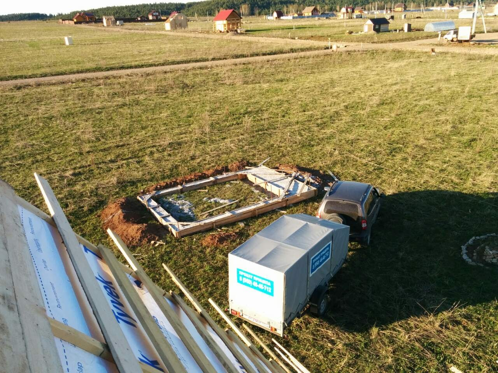

Виды сверху

      

---

Собственно, позвал брата помочь положить крышу. Ну и транспортировать железо.

      

Сруб закрыли металочерепицей, под черепицей лежит Tayvek Soft, по фото сразу видно, что с коньком мы жестко "намудрили", теперь придётся наращивать сверху одну полосу железа, это самое простое, чем перекручивать все целиком. Тем более свободных рук нет, приходится одному делать.

Электричества на участке нет. Резать придется ножницами, пилой пробовал, но упираюсь в душку и дальше совсем не понятно, как пилить.

По плану, в выходные:

1. дозакрепить железо;
2. положить конек;
3. начать делать каркас под окна и фронтоны.

UPD 2021: потом всё железо переложили, уже ровненько)

---

Профрезеровали пашню. Разметили грядки, ну и поставили опалубку под грядки

  
