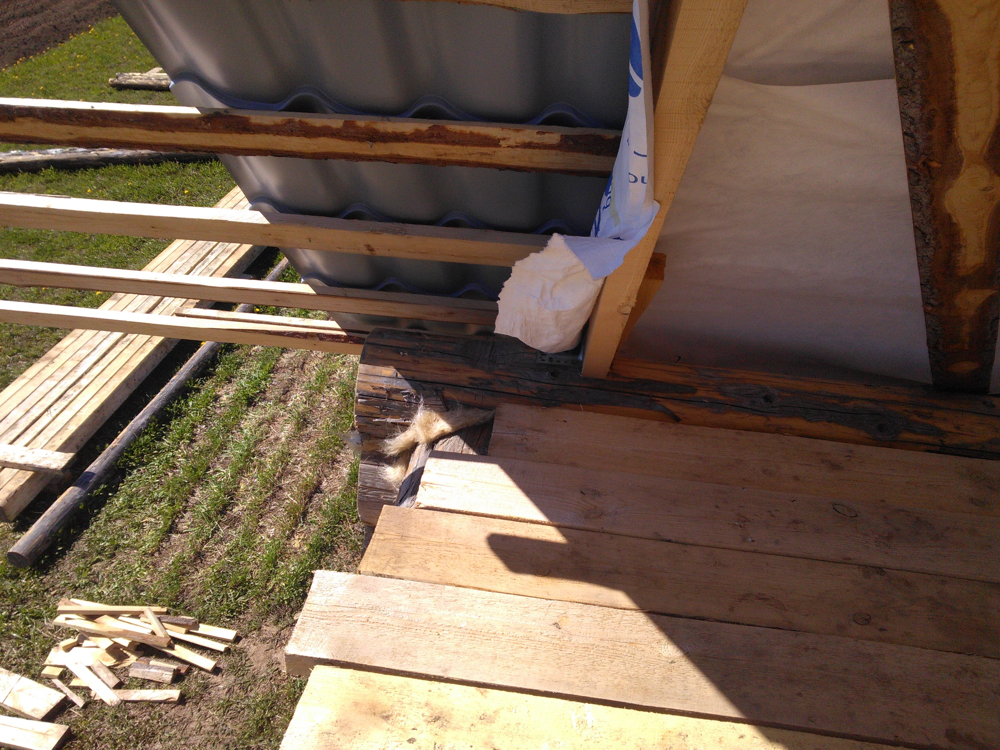

Тем временем рассада уже просится на землю)

  

---

Возник вопрос по фронтонам.

Хочу брусками сделать каркас, в которое потом будет окно вставлено. Брусок набить на верхнее бревно и на обрешетку.
Правильно ли так делать?
Обрешетку с внутренней стороны зашью досками, правильно ли хочу сделать? Где не смотрел, вроде многие так делают, или я чего то не понимаю)

Вот, очень примерный "макет":

Хочу, что то типа такого:

Основной вопрос, куда бруски набиваются, точно ли на обрешетку, но другого варианта вроде и нет.

---

За выходные успел сделать каркас со стороны выносов. Там проще, потому как по стропилам заканчиваются выносы.
Решил к стропилам и крепить каркас.

Сперва сделал обвязку по бревну, её правда надо снизу будет усиливать, но там в любом случае будет брус ставиться.

  

      

И потом брусками сделал сам каркас. Единственное, как его можно ещё усилить по горизонтали, т. е. чтобы из окна не выпасть?)
Оно конечно фронтонами ещё скрепится, но тем не менее.

+ у окон добавлю диагональные бруски, слева и справа, может тоже жесткости добавят.

      

С другой стороны, планирую также сделать, по бревну, внизу, положить 50-ку. К ней по обрешетке бруски (мини ферма), эту ферму свяжу с крайней основной фермой.
Как то так получится

Лучше конечно было бы полноценную ферму сделать, из доски, а не бруса, но один я её не подниму.
