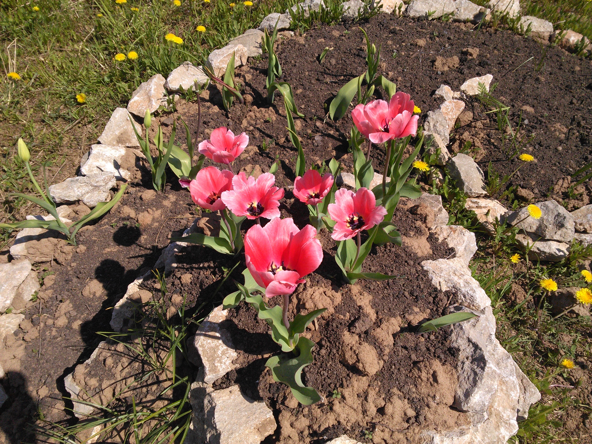
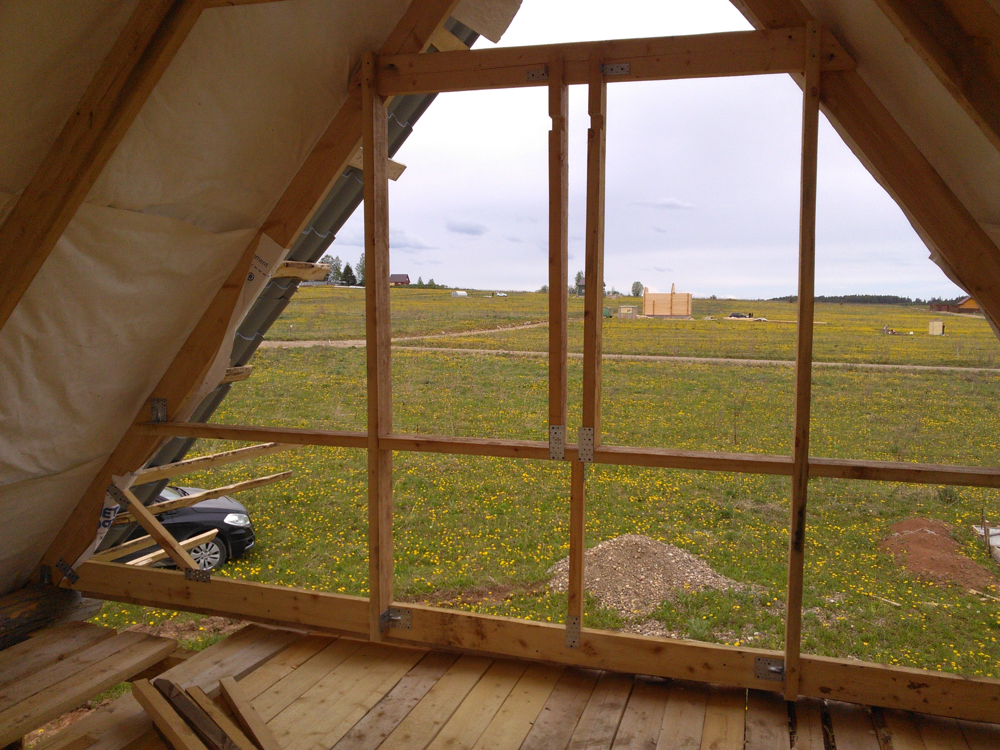
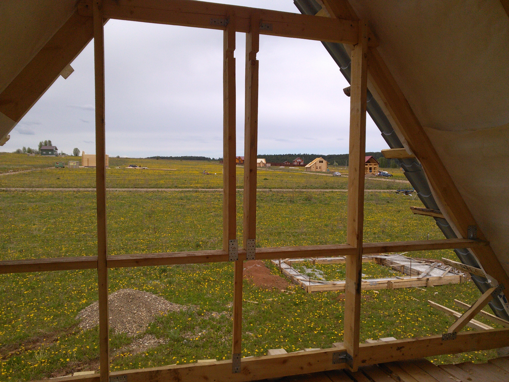
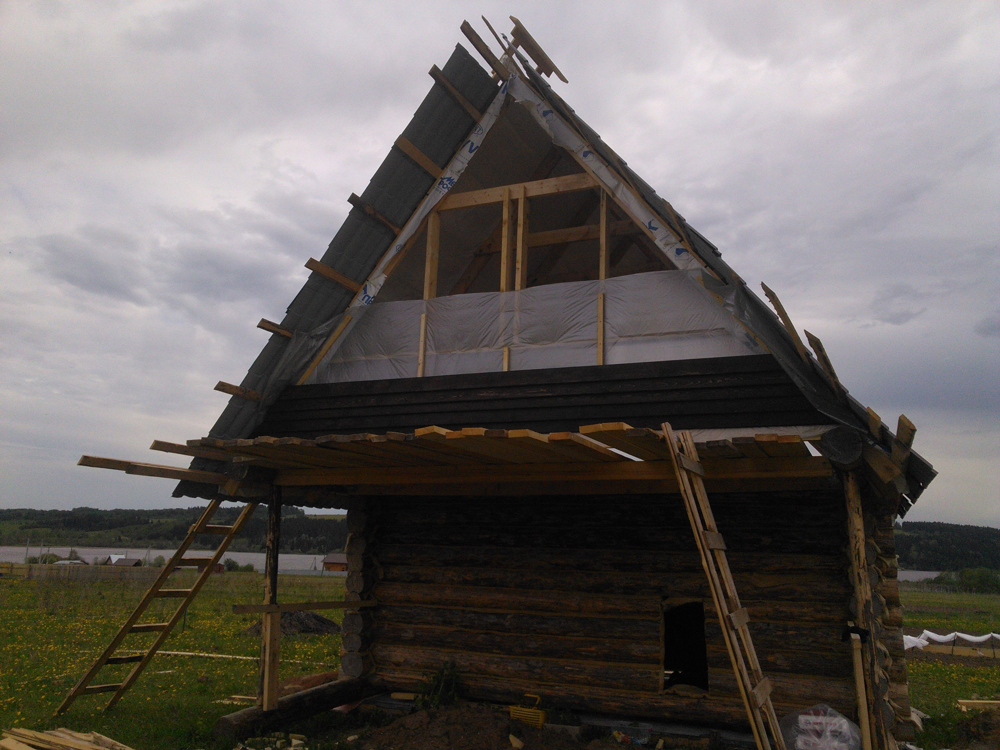
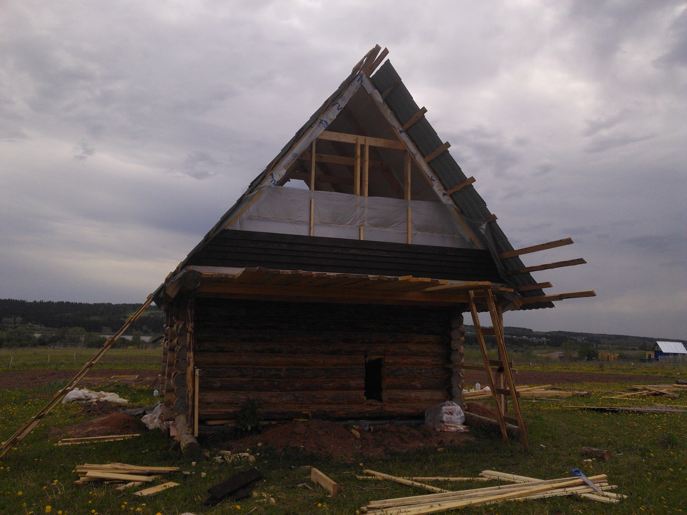
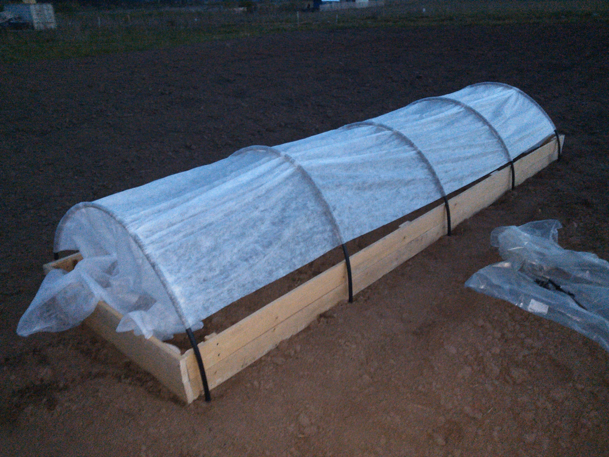
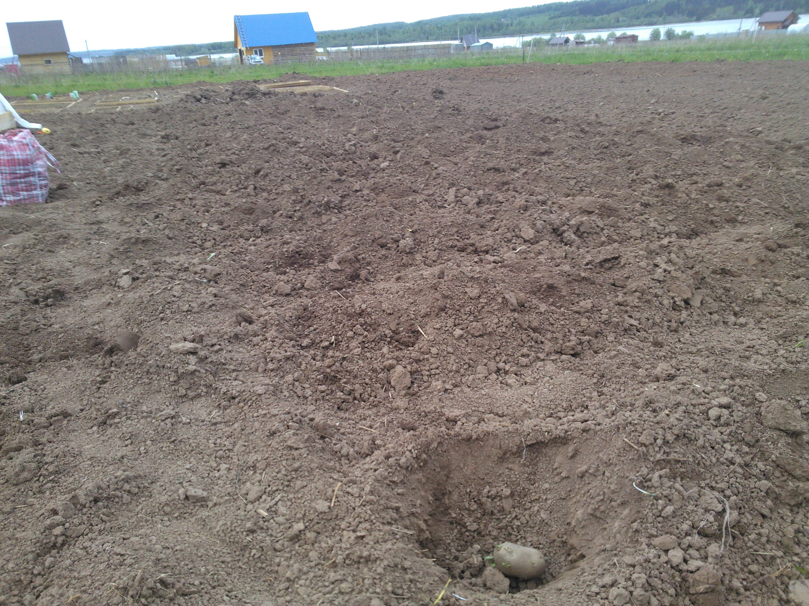

На клумбе распустилась красота

---

Выходные прошли вполне себе продуктивно.

Заменил фронтоны, на доску, 50-ку, стало гораздо привлекательнее и надёжнее:

  

Сверху ещё в вырезы, доску нужно будет вставить.

Снаружи натянули полосу гидроизоляции и положили 5 досок на фронтон:

  

Между делом поставили ещё парники. Рядом посадили немного картошки)

  

В планах на следующие выходные,
доделывать фронтон, и начать что-то делать с другой стороны, там всё намного хуже, т. к. наращивать надо будет...

И на выносу надо скорее компенсационные болты ставить, как собственно и подкатные брёвна.
