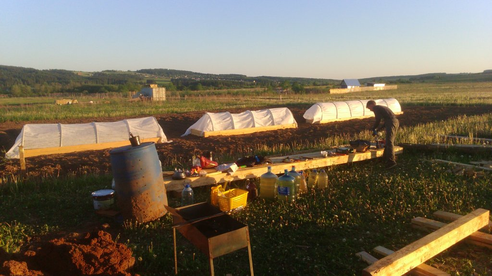
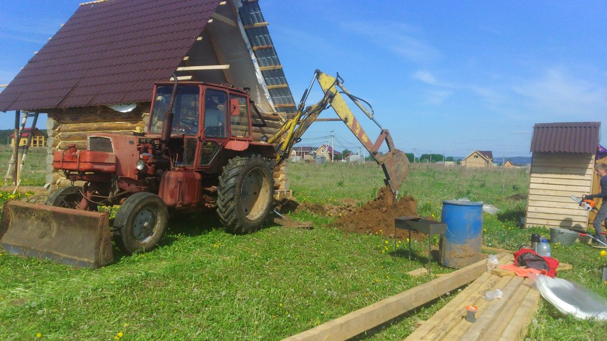
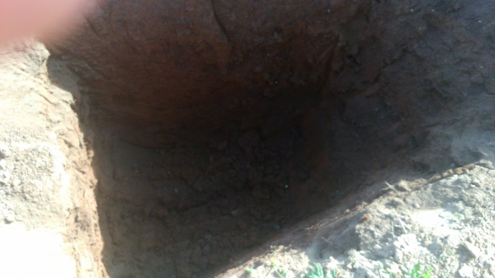
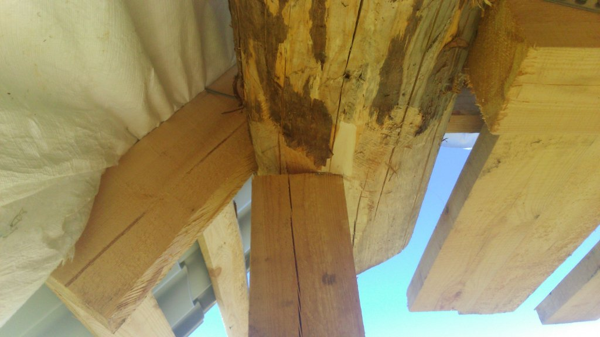
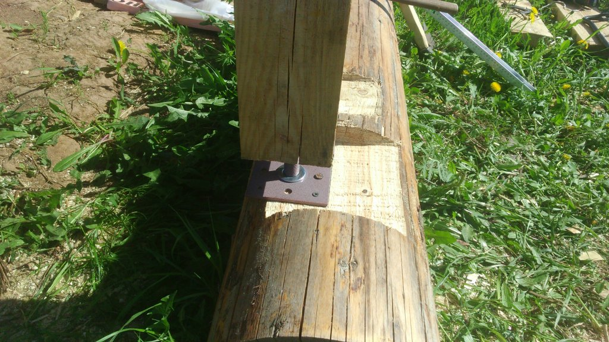
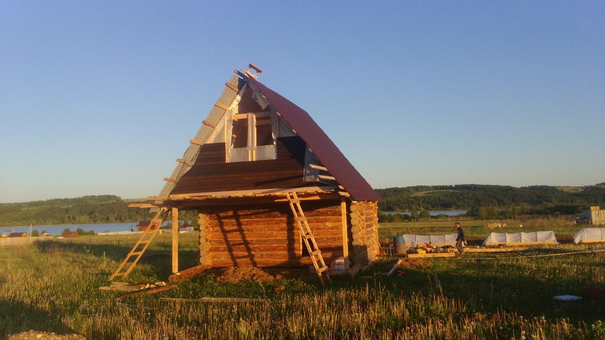
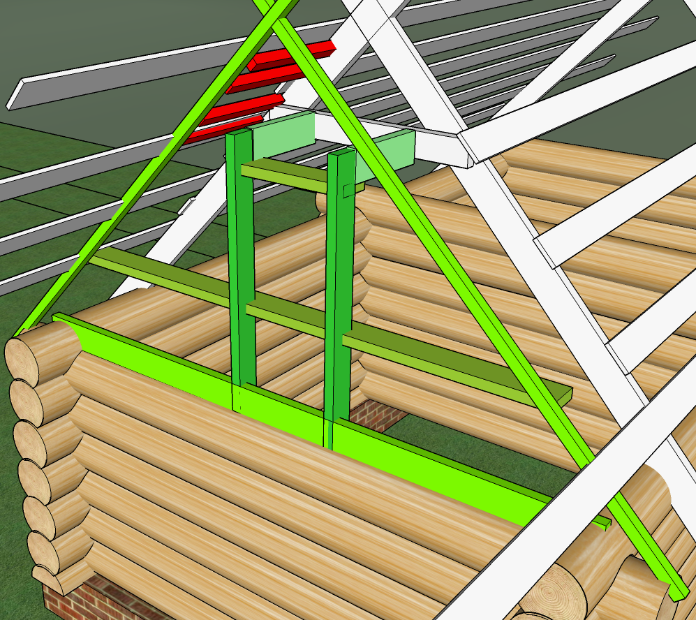
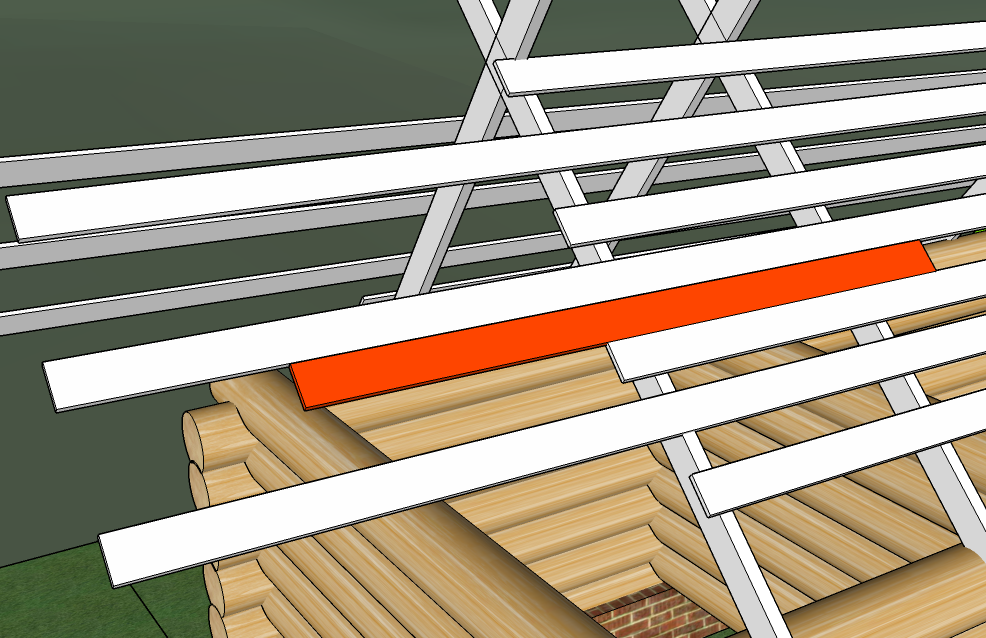

В прошлые выходные большую часть времени занимались огородом.
Поставили ещё один парник, сделали пару грядок.

---

Вырыли яму под слив. Экскаватор вырыл)

  

2,5 метра получилась, внизу вода немного скапливается. Немного ещё сами подрыли. Теперь достаём на полив от туда воду.

---

Попробовал заменить у выносов столбы, на компенсаторы

  

Выявились косяки сруба, верхнее и нижнее брёвна не на одной линии.
Я так понимаю, в верхнем бревне надо делать пропил? Чтобы брус хорошо упирался.
И если я между брусом и верхним бревном в эту выемку подложу деревянную дощечку, плохо это будет? В дальнейшем можно будет убрать. Иначе, боюсь высоты бруса не хватит, после пропила в бревне.

---

Ну и продолжили зашивать фронтон

Остаётся самая сложная часть, придётся видимо лесенку ставить на текущие фронтонные доски и подниматься, зашивать верхние.

---

Продолжаю думать над фронтоном.

Имеет ли место такой вариант:

т. е., на нижнее бревно, хочу положить доску. Вот только бревно не цилиндровка, т. е. не ровное. И трогать его не хотелось бы. Хотя рубанком, наверно можно, немного подравнять, чтобы поровнее было.

Опять же, не совсем понятно, зачем совсем это доска. Вертикальные 50-ки, можно прямо в бревно немного врезать.

Мне больше интересно, как эти самые вертикальные две доски, в которой будет окно, зафиксировать, чтобы они уже никуда не делись. Я их, конечно, прикручу к крайней ферме. Но как то не надежно, мне кажется.

По обрешетке пойдут бруски 50х50. На них же будет фронтонная доска крепиться.

Мне кажется я перемудрил и вообще не то делаю.

И если я просуну доску доску рядом с обрешеткой, на две крайние стропилы, хуже от этого не будет же? Если получится конечно)

