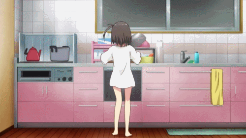

Теперь бложик оживает благодаря <a rel="nofollow" href="https://gohugo.io" target="_blank">Hugo</a> :fire:

А собирается и деплоится во имя <a rel="nofollow" href="http://www.wercker.com/" target="_blank">Wercker</a> :expressionless:

И всё также всё лежит на <a rel="nofollow" href="https://github.com/npofopr/_altyncev" target="_blank">Гитхабе</a> :fist:

Хвала лунной магии! :boom:
