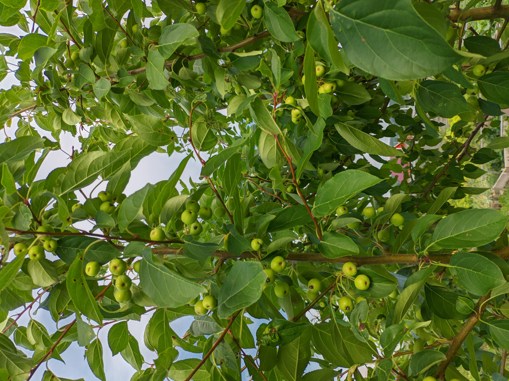

Лето очень жаркое, всё поспевает куда быстрее.

Птицы ягоды уже не так жрут, как в прошлые года. Кроме может виктории, её больше порт

  

  

  

  

    

---

Тепличное:

  

---

Цветочное:

  

  

  

  

---

Котяшное)

  
